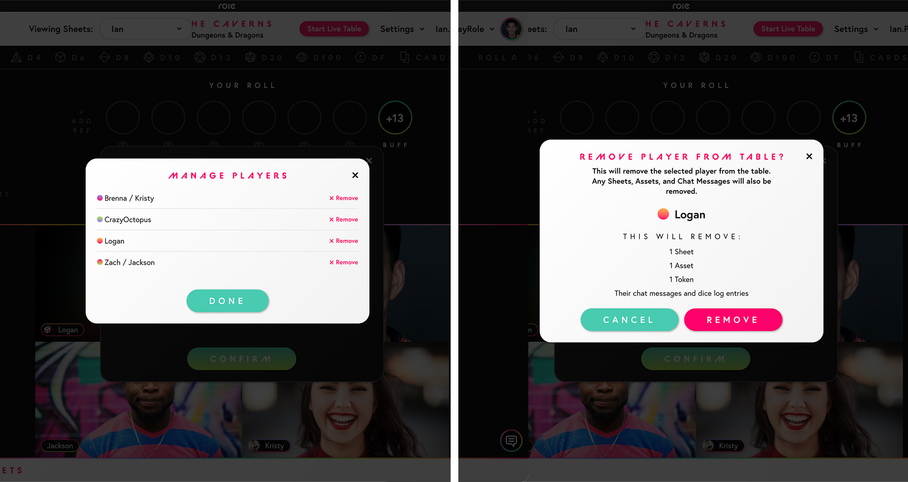
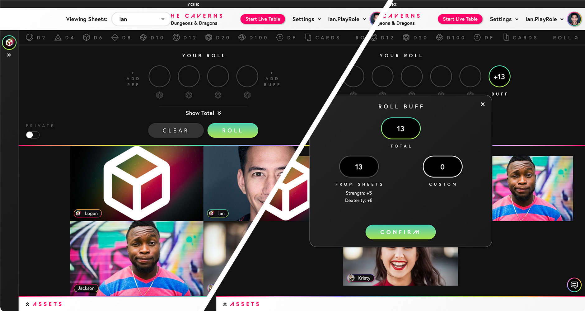

### Safety

#### New Templates

Thank you to [Kienna Shaw](https://twitter.com/KiennaS) and [Lauren Bryant-Monk](https://twitter.com/jl_nicegirl), creators of the TTRPG Safety Toolkit, for putting together the official Role Safety Templates. All accounts will automatically come with three templates to help organize and think about safety when playing on Role. The following templates are now available for everyone:

- [Safety / Support Tool Info Sheet](https://app.playrole.com/sheet-templates/52788ff6-safety-support-tool-info-sheet/save)
- [Lines and Veils](https://app.playrole.com/sheet-templates/77d600a2-lines-and-veils/save)
- [Stars and Wishes](https://app.playrole.com/sheet-templates/662da7fa-stars-and-wishes/save)

More info about Safety on Role coming soon! If you have any feedback as you use these templates please send them our way to [support@playrole.com](mailto:support@playrole.com).

#### Ping

We encourage everyone to set proper safety boundaries ahead of a session so all players feel comfortable. In the event something comes up, we've added the ability for you to **anonymously** ping the entire table in real-time. When you ping the table, a notification appears on everyone's screen, as well as a message in chat. We hope this will help play groups to pause, review their safety tools of choice, and check in to make sure everyone is okay with the session.

To ping the table, open the chat and click red button with an exclamation point next to the send button.

#### Managing Players

Table Hosts can now manage and remove players from a table. A new menu item item located in the Settings dropdown can be found if you are the creator of the table. Removing a player from the table will do the following:

- Immediately boot the player from the table if they are currently connected to it.
- Remove the table from the player's list of joined tables.
- Remove any sheets that player added to the table.
- Remove any assets, including maps and tokens, that the player added to the table.
- Hide any messages and dice log entries the player had sent to the table.

NOTE: This **does not ban** the player from the table. If you want them to re-join you can simply invite them again. If you want to ensure the player cannot re-join your table, we recommend you add or change the password to the table.

### Custom Modifiers and Dice Tray Updates

You can now manually add a reference or buff to your Dice Roll without needing to select something from a sheet! When you open the Dice Tray, you will see two new options: "+ Add Ref" and "+ Add Buff". Clicking one of these will open a modal where you can adjust the modifier. This modal will also list references or buffs you have selected from your sheets. If you already have a ref or buff added to your roll, you can now click them to open the same modal to adjust your modifiers as you see fit.

With this change we've also updated how the Dice Tray works:

- Moved the Cards button next to the dice, and added Roll button that will toggle open the Dice Tray.
- Opening the Dice Tray no longer requires dice to be already selected, and closing the tray no longer automatically clears your roll.
- There is an explicit "Clear" button for when you are done with your currently selected dice and modifiers.

### Misc Improvements and Fixes

- Added the ability to remove a password from your table. To remove a password click "Remove Password" from within Settings > Table Info.
- Added the ability to minimize another player's roll. When a player's roll shows up, there is now a double arrow button that will minimize it so it doesn't take up as much space.
- Fixed immediately removing a player's sheets and assets if they permanently leave a table.
- Fixed re-sending your roll to other players if you toggle Private Roll off.
